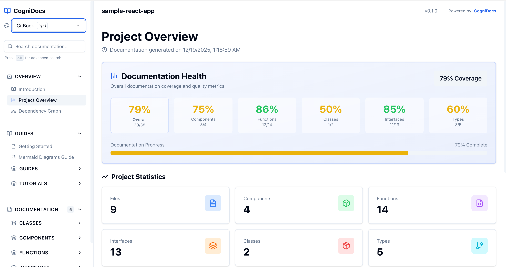
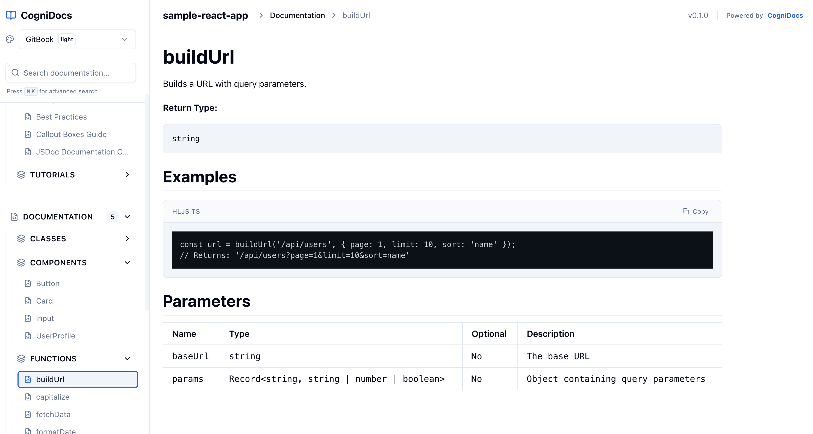
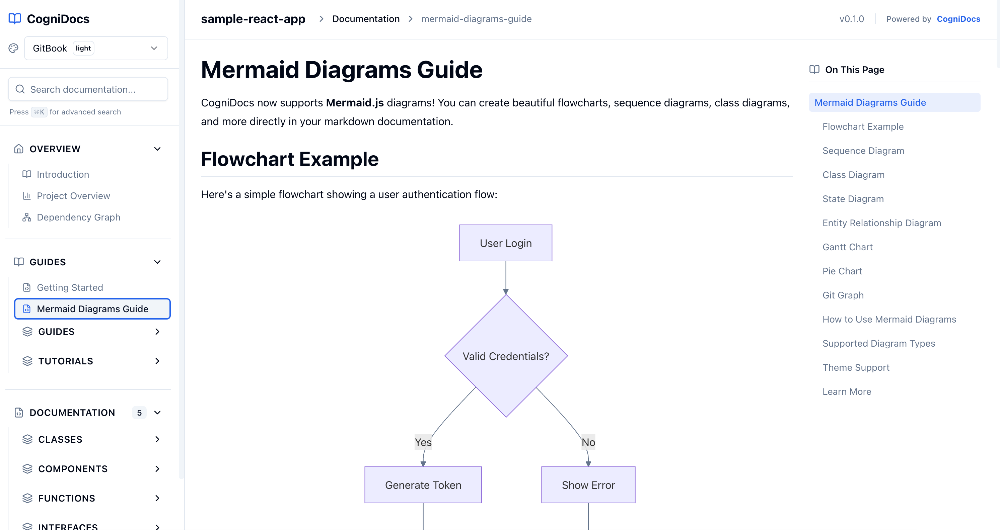
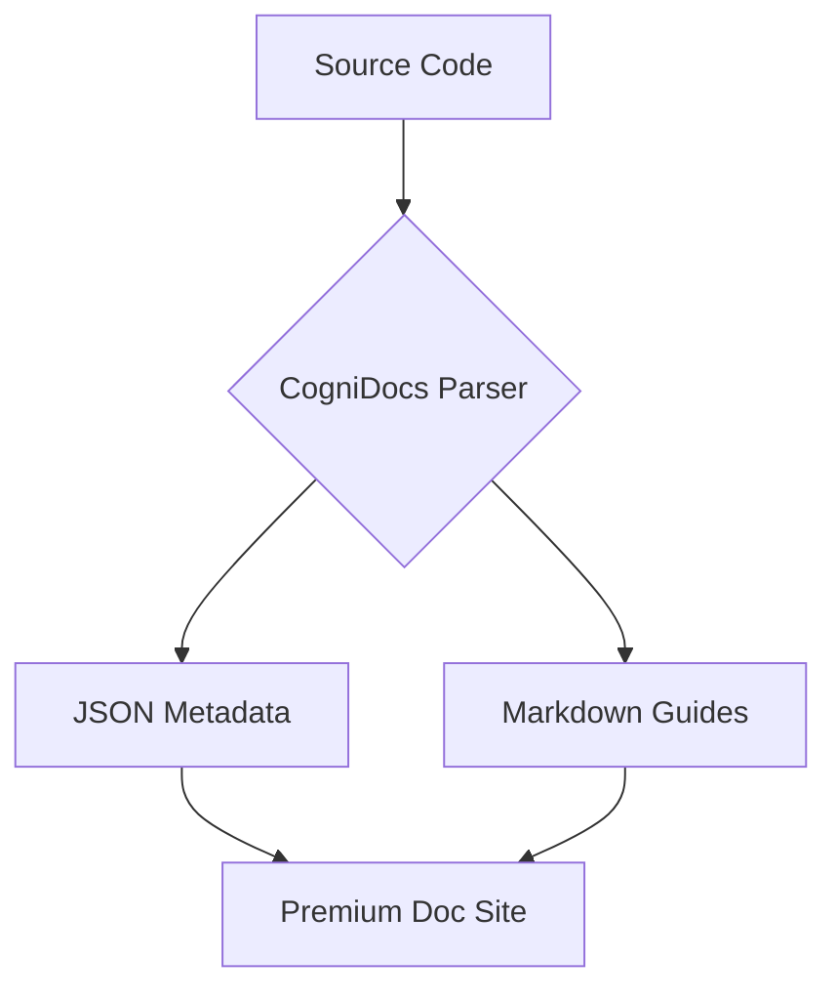

# CogniDocs

> 🚀 Premium documentation for TypeScript & React, Next.js, Vue, and Svelte — automatically generated from your code.

[](https://www.npmjs.com/package/@cognidocs/cli)
[](https://opensource.org/licenses/MIT)
[](https://nodejs.org)

CogniDocs is a comprehensive documentation tool for JavaScript and TypeScript. Point it at your codebase, and it generates a stunning, premium documentation site with interactive dependency graphs, detailed coverage reports, and 12 professional themes.

**[🌐 View Live Demo](https://abishekraj.github.io/cognidocs/)** — See CogniDocs in action!

---

## 📸 Preview


_Interactive Dashboard with documentation health metrics and coverage analysis._


_Detailed component documentation with props tables and source code view._


_Mermaid.js diagrams for visualizing complex logic._

---

## ⚡ Features at a Glance

### 🤖 Intelligent Code Parsing

- **Multi-Framework Support** - Native support for **React**, **Next.js**, **Vue 3**, and **Svelte**.
- **TypeScript & JavaScript** - Full AST parsing for both `.ts/.tsx` and `.js/.jsx` files.
- **Deep Export Detection** - Handles all export patterns (default, named, re-exports, aliases).
- **Rich JSDoc Rendering** - Supports `@example`, `@see`, `@link`, `@tutorial`, `@deprecated`, and more.

### 📊 Deep Analysis

- **Coverage Reports** - Track documentation health across 6 categories: Components, Modules, Functions, Classes, Interfaces, and Types.
- **Project Metrics** - Get instant insights into your project's complexity and structure.
- **Zero Configuration** - Intelligent defaults that work out of the box.

---

## 💡 Documenting Your Code (JSDoc)

CogniDocs automatically extracts information from your JSDoc comments. Here’s how to document your code for the best results:

### React Components

Document props and provide usage examples.

```tsx
/**
 * A premium button component with multiple variants.
 *
 * @component
 * @example
 * <Button variant="primary" onClick={() => console.log('Clicked!')}>
 *   Click Me
 * </Button>
 */
export const Button = ({ variant, children, ...props }: ButtonProps) => {
  return (
    <button className={variant} {...props}>
      {children}
    </button>
  );
};
```

### Functions & Logic

Use standard JSDoc tags for parameters and return types.

```typescript
/**
 * Calculates the total price including tax.
 *
 * @param price - The base price of the item
 * @param tax - The tax rate (e.g., 0.15 for 15%)
 * @returns The final price with tax applied
 *
 * @deprecated Use `calculateTotalV2` for better precision.
 * @see {@link https://api.docs.com/pricing}
 */
export function calculateTotal(price: number, tax: number): number {
  return price * (1 + tax);
}
```

---

## 🛠 Supported Frameworks

CogniDocs handles the specific patterns of your favorite frameworks:

| Framework   | Support Details                                                                    |
| ----------- | ---------------------------------------------------------------------------------- |
| **React**   | Function & Class components, Hooks extraction, Props detection, JSX/TSX support.   |
| **Next.js** | Full support for App Router & Page Router, API route documentation.                |
| **Vue 3**   | Single File Components (SFC), Composition API (`<script setup>`), and Options API. |
| **Svelte**  | Component props, events, stores, and reactive statements (`$:`) extraction.        |

---

## 🚀 Quick Start in 60 Seconds

### Installation

Choose your preferred package manager:

```bash
# npm
npm install -g @cognidocs/cli

# pnpm (Recommended)
pnpm add -g @cognidocs/cli

# npx (Try without installing)
npx @cognidocs/cli init
```

### Usage

```bash
# 1. Initialize your project
cognidocs init

# 2. Build your documentation
cognidocs build

# 3. Preview locally
cognidocs serve
```

Your documentation site will be generated in the `./docs` directory.

---

## ⚙️ Configuration

Create a `cognidocs.config.js` in your root:

```javascript
export default {
  entry: './src', // Source directory
  output: './docs', // Output directory
  theme: 'gitbook', // Theme (12 available)
  darkMode: true, // Toggle dark mode
  frameworks: ['react'], // Primary framework
  name: 'My Project', // Documentation title
  exclude: ['**/node_modules/**', '**/dist/**', '**/*.test.ts'],
};
```

### Available Themes

- `gitbook` (Light/Dark)
- `github` (Light/Dark)
- `nord` (Light/Dark)
- `dracula`
- `monokai`
- `solarized-light`, `solarized-dark`
- `one-dark`
- `material-light`, `material-dark`

---

## 📋 CLI Commands

| Command              | Description                                            |
| -------------------- | ------------------------------------------------------ |
| `cognidocs init`     | Initialize configuration (use `-y` for defaults)       |
| `cognidocs build`    | Generate the documentation site                        |
| `cognidocs serve`    | Start dev server with live reload (default port: 4173) |
| `cognidocs analyze`  | Generate interactive dependency graphs                 |
| `cognidocs coverage` | Calculate documentation coverage metrics               |

---

## 📚 Custom Documentation (Guides)

Beyond auto-generated API docs, you can add custom guides (like a "Getting Started" or "Architecture" page).

### How to add Guides

1. Create an `additional-documentation/` folder in your project root.
2. Add `.md` files to this folder.
3. Use YAML formatter to organize them:

```markdown
---
title: Getting Started
description: Quick start guide for new users
category: Guides
order: 1
---

# Getting Started

Your content here...
```

CogniDocs will automatically discover these files and list them under a **"Guides"** section in the sidebar.

---

## 💎 Advanced Markdown Features

CogniDocs premium UI includes built-in support for advanced markdown elements:

### 🧜‍♂️ Mermaid.js Diagrams

Visualize complex logic with native Mermaid support.



### 🎈 Callout Boxes

Highlight important information using the `:::type` syntax:

:::info
This is an information callout.
:::

:::warning
This is a warning callout.
:::

:::tip
This is a helpful tip.
:::

:::danger
This is a critical danger callout.
:::

---

## 📁 Output Structure

The `build` command generates a production-ready static site:

```text
docs/
├── index.html              # Main SPA
├── assets/                 # Optimized JS/CSS chunks
├── content/                # Generated documentation data
│   ├── manifest.json       # Navigation structure
│   ├── components/         # Parsed component documentation
│   └── guides/             # Custom .md files
└── data.json              # Full project metadata
```

## 🤝 Contributing & Community

We welcome contributions! See [CONTRIBUTING.md](CONTRIBUTING.md) to get started.

- 🐛 **Bugs:** [Report an issue](https://github.com/abishekraj/cognidocs/issues)
- ⭐ **Support:** Give us a star on [GitHub](https://github.com/abishekraj/cognidocs)!

Built with ❤️ by the open-source community.
