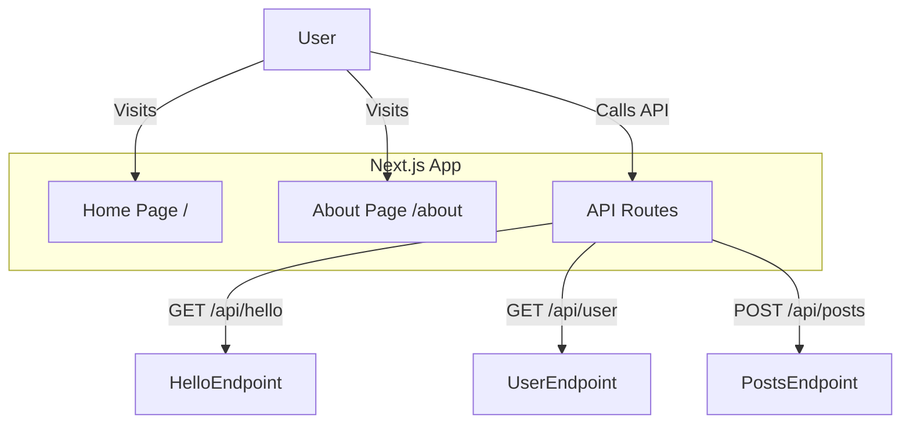
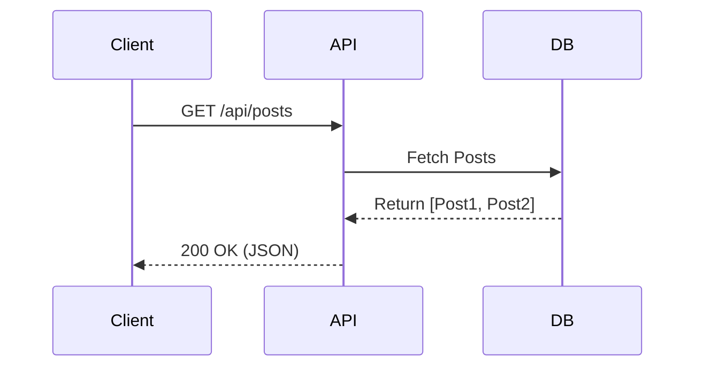

# Sample Next.js Project

This is a sample project to demonstrate **CogniDocs** capabilities with Next.js applications.

## Architecture

Here is a high-level overview of the application flow:

## Data Flow

