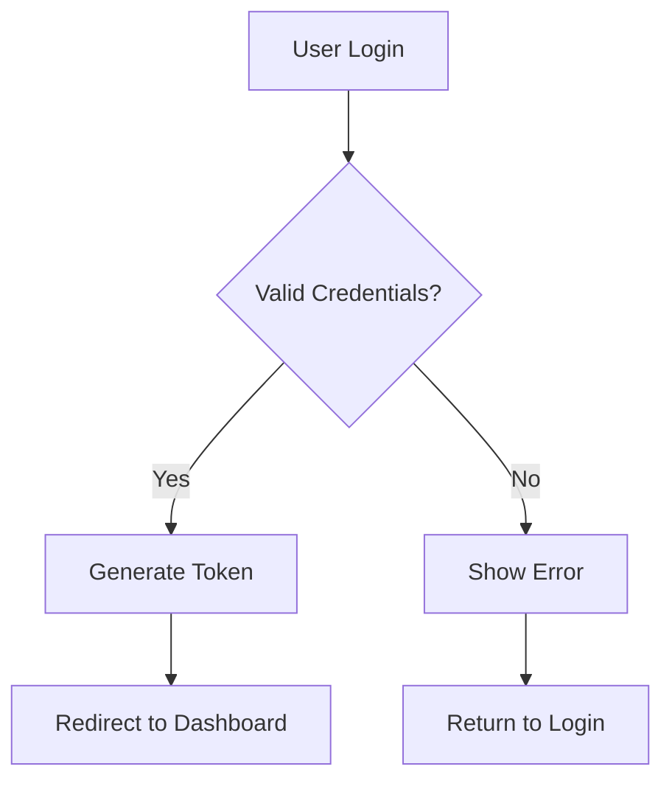
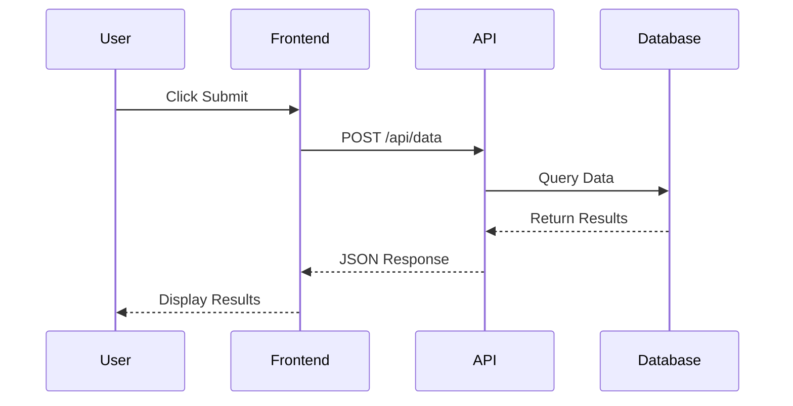
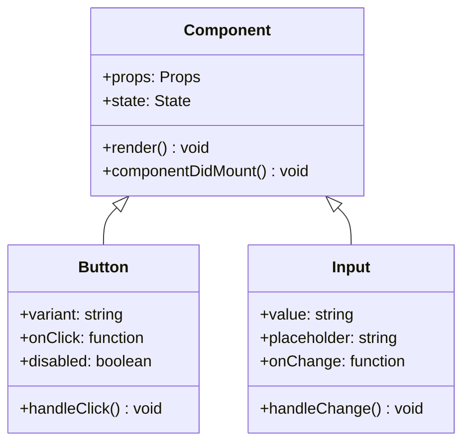
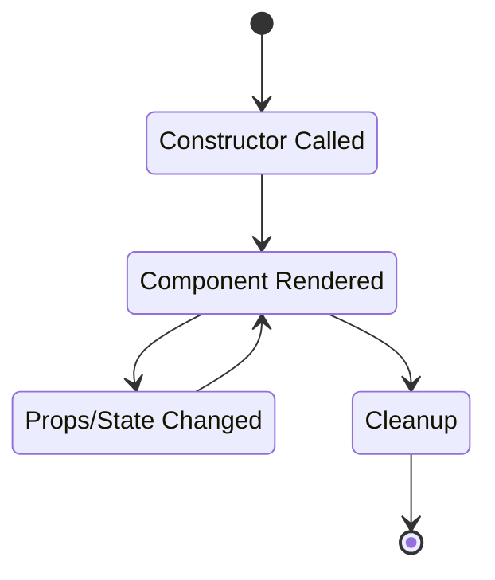
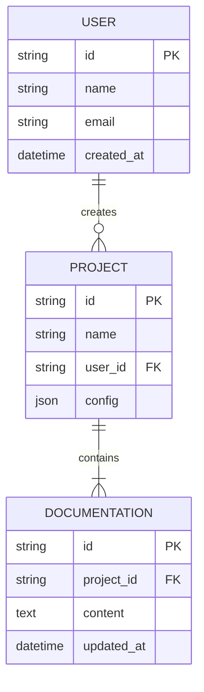
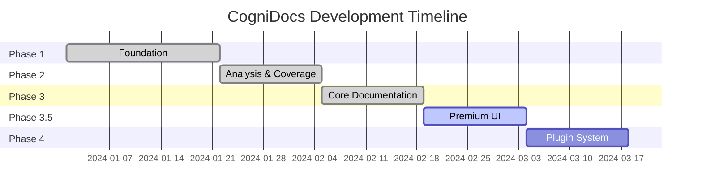
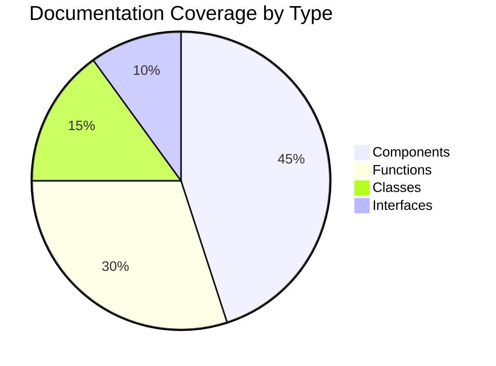
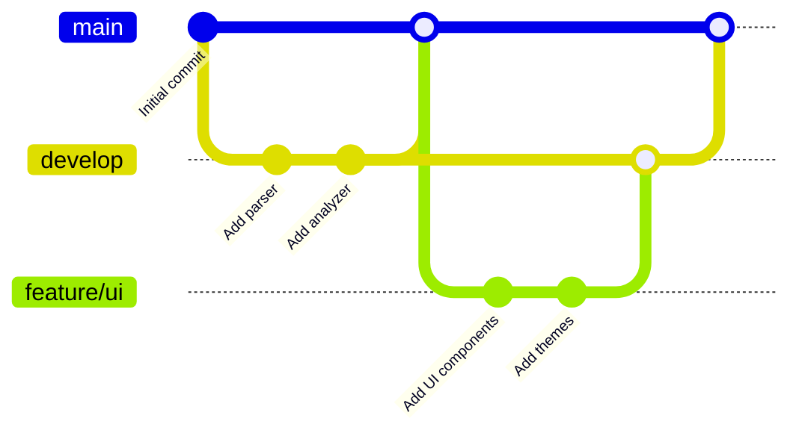
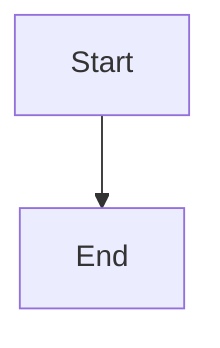

# Mermaid Diagrams Guide

CogniDocs now supports **Mermaid.js** diagrams! You can create beautiful flowcharts, sequence diagrams, class diagrams, and more directly in your markdown documentation.

## Flowchart Example

Here's a simple flowchart showing a user authentication flow:



## Sequence Diagram

A sequence diagram showing API interaction:



## Class Diagram

A class diagram showing component relationships:



## State Diagram

A state diagram showing component lifecycle:



## Entity Relationship Diagram

An ER diagram showing database relationships:



## Gantt Chart

A project timeline using a Gantt chart:



## Pie Chart

Documentation coverage breakdown:



## Git Graph

A git branching workflow:



## How to Use Mermaid Diagrams

To add a Mermaid diagram to your documentation, simply create a code block with the language set to `mermaid`:

````markdown

````

The diagram will automatically render with the theme matching your current site theme!

## Supported Diagram Types

- **Flowcharts** - `graph TD`, `graph LR`
- **Sequence Diagrams** - `sequenceDiagram`
- **Class Diagrams** - `classDiagram`
- **State Diagrams** - `stateDiagram-v2`
- **Entity Relationship Diagrams** - `erDiagram`
- **Gantt Charts** - `gantt`
- **Pie Charts** - `pie`
- **Git Graphs** - `gitGraph`
- **User Journey** - `journey`
- **Quadrant Charts** - `quadrantChart`

## Theme Support

Mermaid diagrams automatically adapt to your selected CogniDocs theme:
- Light themes use the default Mermaid theme
- Dark themes (Dracula, Monokai, Nord Dark, etc.) use the dark Mermaid theme
- Colors are extracted from CSS variables for consistency

## Learn More

For complete Mermaid.js documentation and syntax, visit:
- [Mermaid Official Docs](https://mermaid.js.org/)
- [Mermaid Live Editor](https://mermaid.live/)
